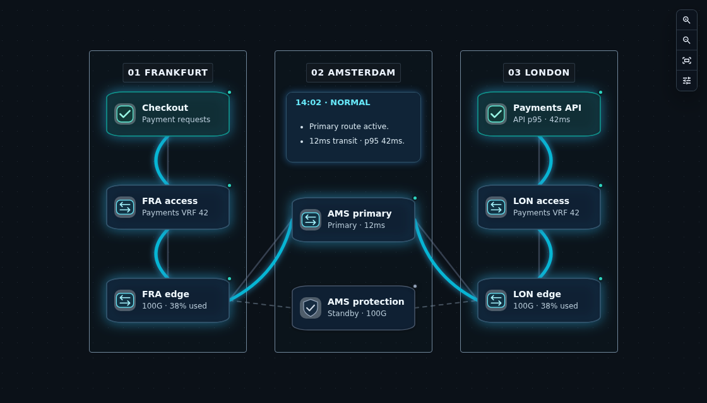
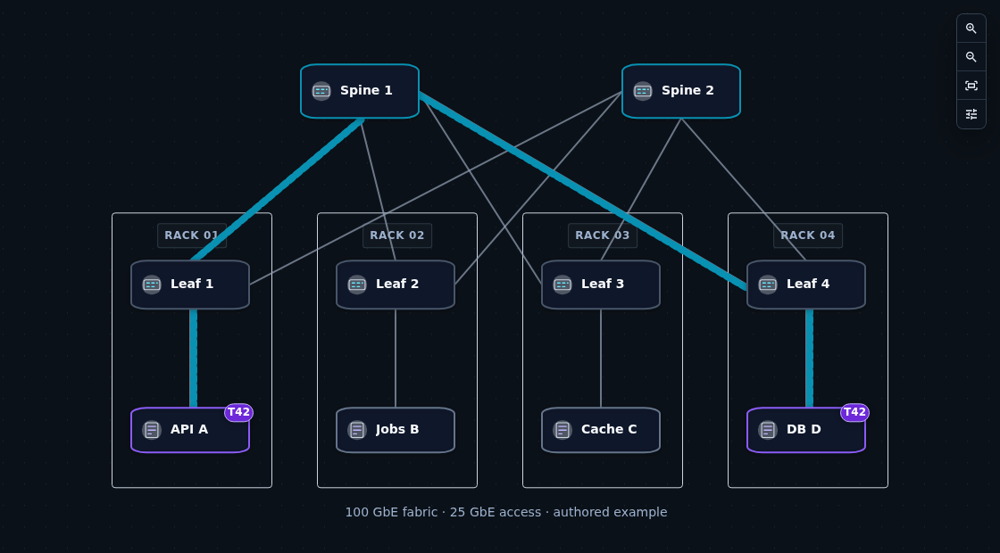
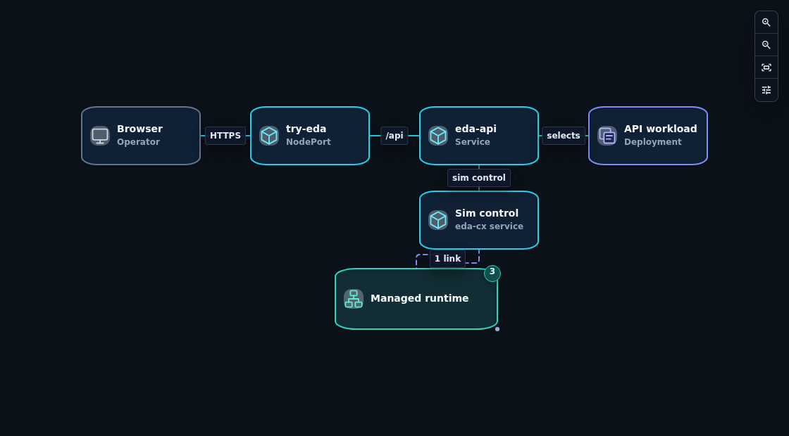
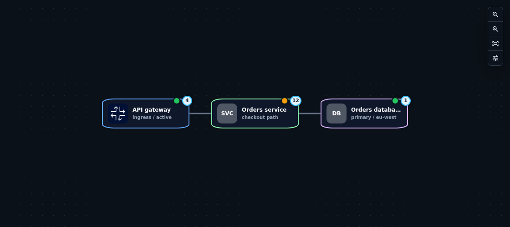
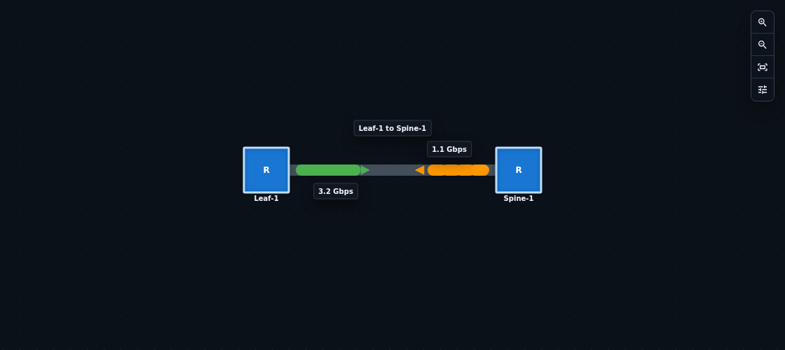
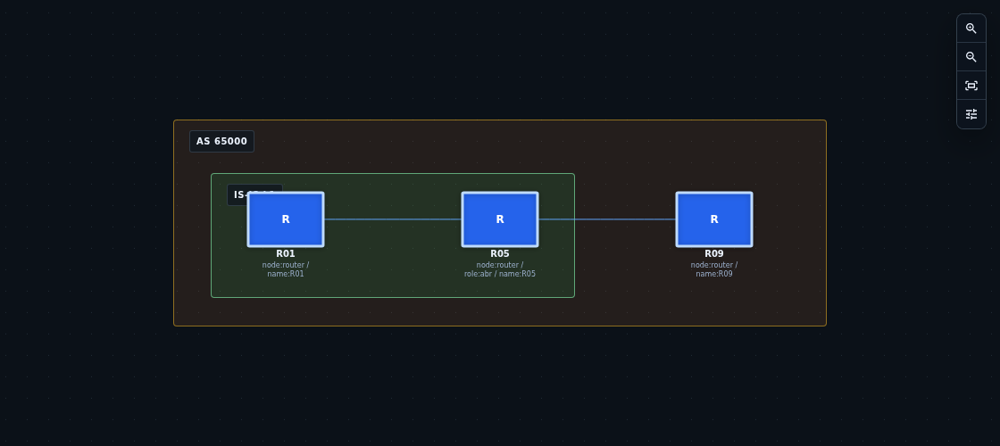
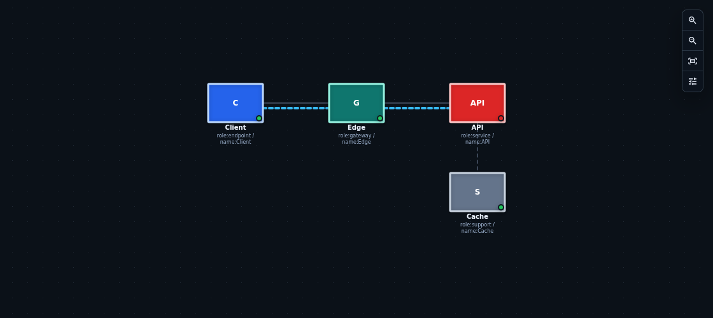
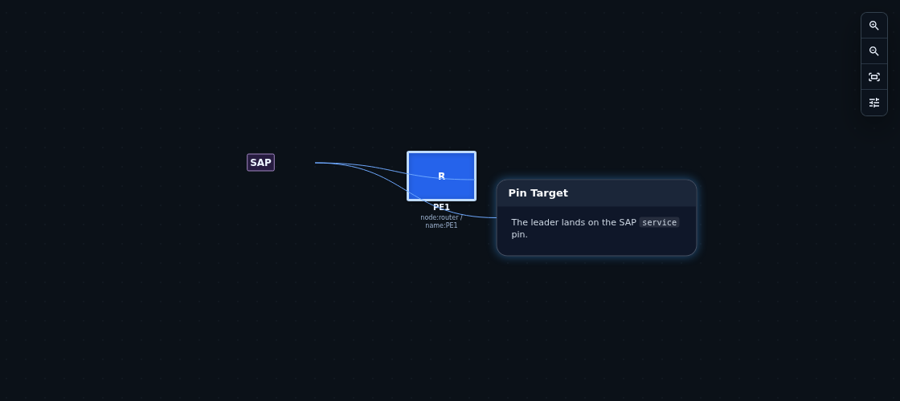
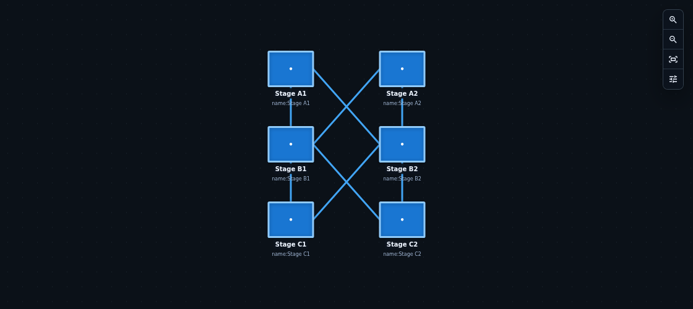

---
hide:
  - toc
---
<!-- Generated from packages/topoviewer/content/gallery.json by scripts/sync-gallery.mjs. -->
# Explore what your topology can tell you

Trace a service across a network. Follow a packet through a fabric. Unfold the workloads behind an endpoint. Start with a question, then explore the diagram.

<nav class="tv-gallery-links" aria-label="Browse examples"><a href="#guided-scenarios">Guided scenarios</a><a href="#patterns-to-borrow">Patterns to borrow</a><a href="../start/first-topology/">Build your first diagram</a></nav>

## Guided Scenarios

Three small investigations, with live diagrams, things to try, and source files to keep.

<a class="tv-gallery-card tv-gallery-featured" href="use-cases/service-provider-network/">
  
  

    01 / Service provider
    <h3>Payments across three metros</h3>
    
A fiber cut. One customer service. Follow the impact and compare the recovery route.

    Trace the service ↗
  

</a>
<a class="tv-gallery-card tv-gallery-featured" href="use-cases/follow-a-packet/">
  
  

    02 / Data center
    <h3>Follow a packet through the fabric</h3>
    
See the tenant journey inside a spine–leaf fabric, then reveal ports and traffic directions.

    Follow the packet ↗
  

</a>
<a class="tv-gallery-card tv-gallery-featured" href="use-cases/kubernetes-service-map/">
  
  

    03 / Kubernetes
    <h3>What sits behind this endpoint?</h3>
    
Start at the entry point. Unfold its workloads and discover the infrastructure they manage.

    Explore the service map ↗
  

</a>

These are reproducible examples with authored states. Each walkthrough explains its data and assumptions. Download the YAML bundle or import its <code>.tvstudio</code> archive to make it your own.

## Patterns To Borrow

Learn one visual technique, then bring it into your own diagram.

<a class="tv-gallery-card" href="nodes/card-node-layout/">
  
  

    <h3>Service cards</h3>
    
Give names, roles, and status a clear place.

    Open the pattern ↗
  

</a>
<a class="tv-gallery-card" href="edges/directional-link-strokes/">
  
  

    <h3>Two traffic directions</h3>
    
Read both directions on one physical link.

    Open the pattern ↗
  

</a>
<a class="tv-gallery-card" href="regions/nested-regions/">
  
  

    <h3>Regions within regions</h3>
    
Explain sites, domains, and shared membership.

    Open the pattern ↗
  

</a>
<a class="tv-gallery-card" href="attention/object-focus/">
  
  

    <h3>Focus and context</h3>
    
Follow one object without losing the network.

    Open the pattern ↗
  

</a>
<a class="tv-gallery-card" href="callouts/pins-and-leaders/">
  
  

    <h3>Anchored explanations</h3>
    
Attach a short explanation to the right object.

    Open the pattern ↗
  

</a>
<a class="tv-gallery-card" href="layout/clos/">
  
  

    <h3>An orderly fabric</h3>
    
Arrange stages with a repeatable CLOS layout.

    Open the pattern ↗
  

</a>

## Find A Specific Feature

The focused examples stay small so you can see exactly which source field changes the result.

| Build the model | Shape the view | Explain and inspect |
|---|---|---|
| [Graph](graph/index.md) · [Nodes](nodes/index.md) | [Edges](edges/index.md) · [Paths](paths/index.md) | [Attention](attention/index.md) · [Regions](regions/index.md) |
| [Authoring](authoring/index.md) | [Styling](styling/index.md) · [Layout](layout/index.md) | [Callouts](callouts/index.md) · [Shapes](shapes/index.md) |
| [Validate your files](../author/validate-yaml.md) | [Text](text/index.md) | [Object family lookup](object-family-examples.md) |

To embed a diagram in your own product or documentation, use the [integration guides](use-cases/index.md).
