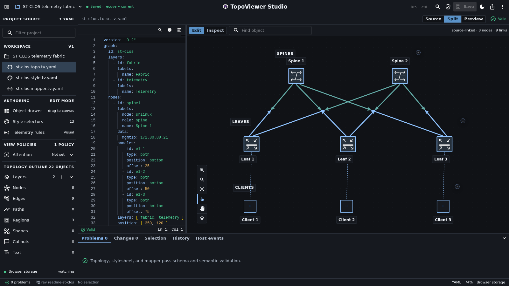

# Why TopoViewer

TopoViewer renders interactive topology diagrams from YAML. Use it when a
network, service map, or infrastructure diagram needs stable object IDs,
reusable styling, filtering, and inspection across documentation and products.

## One Model, Several Views

| Source | Responsibility | Example |
|---|---|---|
| `topology.yaml` | Objects and relationships. | Router IDs, Ethernet links, site membership, service paths. |
| `stylesheet.yaml` | Visual policy. | Router icons, link colors, labels, layout. |
| Optional `mapper.yaml` | Runtime telemetry bindings. | Map a utilization sample to a known link. |

A topology and stylesheet can render in MkDocs, a Zensical/static HTML adapter,
a React application, and Studio. The experimental Grafana panel adds telemetry
overlays. Each integration has its own setup and support boundary; portability
of the source does not make all integrations equally mature.

## Choose It For The Right Job

| Your task | Likely fit |
|---|---|
| A small explanatory flowchart in Markdown | A general diagram language such as Mermaid may be simpler. |
| A sketch or manually composed illustration | A drawing tool may require less setup. |
| A topology whose IDs, layers, and relationships should be reviewed in Git | TopoViewer's YAML model is useful. |
| Repeated diagrams sharing a visual convention | Selectors and reusable stylesheets avoid editing every object. |
| A custom node editor with unrelated semantics | React Flow provides lower-level rendering primitives. |
| Inventory-derived operational views | TopoViewer can render them; your adapter still owns extraction, stable IDs, and updates. |

TopoViewer does not discover a network or replace an inventory or observability
system. Integration work includes producing the YAML model, validating it, and
keeping it current. The [adoption guide](../evaluate/adopt-topoviewer-or-keep-topology-locked-to-a-surface.md)
explains that cost and a small evaluation exercise.

## Try A Complete Small Workflow

[First Topology](first-topology.md) creates a local two-router page with the
MkDocs plugin. Continue through [styling](style-your-first-topology.md),
[validation](../author/validate-yaml.md), and [export](export-your-first-topology.md)
using the same files. For visual creation, use [Studio First Project](../author/studio/first-project.md).

The [Service Provider Network](../examples/use-cases/service-provider-network.md)
then shows how one larger model answers underlay, BGP, transport, service-path,
and failure-impact questions. Check the [compatibility and support boundaries](../reference/compatibility.md)
before choosing an integration for deployment.
